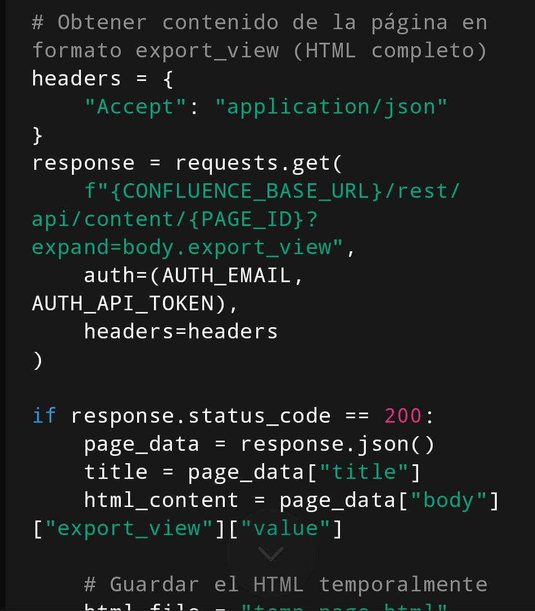

# python confluence-script-runner / confluence-reader-script

From a template for a python project.

## Features

- poetry for dependency management
- black and black for code formatting
- flake8 for linting
- Editorconfig included
- Gitignore file included
- Gitlab CI for running CI jobs
- pre-commit configured
- Project-wide configuration for vscode and coc (vim)


## Requirements

```bash
  pip install -r requeriments.txt
```

```bash
set PYTHONIOENCODING=utf-8
set PYTHONLEGACYWINDOWSSTDIO=utf-8
```


## WORK IN PROGRESS...




# confluence-script-runner
